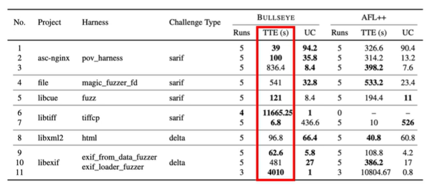

# AIxCC 第一名 CRS(Cyber Reasoning System 網路推理系統) 演講筆記
<!-- https://www.youtube.com/watch?v=TWIyZo1b6a8 -->
## CRS 系統核心 

1. heavily rely on instrumentation: rewrite everything in LibAFL(common code that can be used for target instrumentation)
2. 用 SARIF、diff mode(delta mode) 來提供一些indicator 來決定哪些harness 是有用的 (因為 fuzzing 的 harness 可能會有很多，但不見得每個都跟 vulnerability 有關係)
3. LLM based input generation (inspire by libDeepGen): LLM generate the code that create seed
4. directed fuzzer: implement a custom version of directed fuzzer and integrate Static analysis (Centrality-based Distance calculation、landmark selection) to reach the target faster
    雖然不是很正當的設計決策，因為他們針對的目標是比賽所設定的，或是將最近的commit內容當作target，這些都不是很實際的情境，但他們的設計決策是為了在這些情境下達到最好的效果 (determine the target based on the recent commit, and use directed fuzzer to reach the target faster)
    - naively, they filter out seeds that is not getting closer to the target. quote: "naive version that you can simply filter out the seed then select the seed in the right way then we can hope for the best that it can reach the target location uh gradually at a time or we can you we can implement some crazy component like we can perform static analysis during the compilation and figure it out what what are the important location during during the time"
    - quote: "So we place we leverage the concept of graph centrality basically indicate that whenever you reach the certain basic block there's a high possibility that you're going to reach the other place. We recognize those places all over the places and gradually reach uh the target locations that we specify during the executions of the directive puzzle."
    

## FULL subtitle

Team Atlanta’s Takeaways from DARPA's AIxCC - YouTube

Transcripts:
(00:00) [Music] Thank you for the introduction. Uh I'm Tessu Gim. I'm currently professor at Georgia Tech and also VP at Samsung Research. Today I'm going to talk about our takeaway from this DARPA exchange challenge. Although I'm presenting this, this is work by a lot of our amazing students and engineers and hackers in our group and we just won the competitions.
(00:44)  Where where's our people? Yeah. But most importantly though, um we not just win the competition, we actually won the competition by far. If you can see those presentations of slides, if you combine the four last people, in fact, we we score more than them. Uh we are similar to the two other peoples in top three.
(01:10)  Okay, today I don't have enough time to talk about all these details of our system design, but I hope that I can share some of the lessons that we have. Uh before we kick off, let's think about one problem uh one question. What about we give uh all these repository that we've been working on and select chat histories and some technical report and blog posting all together to the LLM and ask to create the slide or what about we provide all these public informations about and ask LLM to create the competitive CRS against us. Everyone think this is
(01:49) not going to work. You why but why not? you you can think of two different way um either our security tasks in DAPC either fundamentally difficult or today's LLM are not yet ready to handle this complexity but we started our journey as AI skeptics we thought that those type of security problem are extremely difficult so that even AGI system cannot handle it but it turns out it's a limitations of today's LLM.
(02:24)  We hope that future AGI system can solve all these security challenges in AIC. Dealing with this LLM is more like uh the today's LM is more like the Jack Jack and Incredible. Not sure you guys watch this amazing animation. The Jack Jack is a superhero. uh is born out of two superhero as a parent but we don't know what type of superpower he has but it has a tons of hidden potential uh it has um is a speedy and it has electromagnetism for example there's so many different potentials in LLM but our experience of interacting with today's
(03:05) LLM is more like how to babysit this jetack sometimes we can ask it to become a security researcher hope that this monster expresses a superhero power superpower so that it really behave like security researchers but more than more than often uh it fail. Whenever it fail we often threatening it.
(03:28)  Hey you really have to work hard or sometime we we do chair reading say what about we give you $10 or $200 so that we hope that this baby monster can can perform with this hidden potentials uh in solving our challenges. We studied again we studied this competition as AI skeptics but for reasons. We evaluate tons of the different LLMs by by ourself not just not limited to the commodity LLMs that we can access to.
(03:59)  We also evaluate lots of custom models as well. But at the time the most of the discussions is more about uh how to do the promp engineering. Well, we talk about there's a uh chain of thought or tree of thought or self-consistency. This little the tiny little details and prom engineering has emerge at the time. But interestingly, this is the moment that people discovering some magic sentence.
(04:25) Uh some this is one of the blog posting from uh some people and people discovered that if you tip if you provide a sentence they provide a tip we start responding longer than expected but not limited to tipping behavior of the LLM. We start singing tons of similar properties like we have to do the gaslighting or sometimes we instead of being kind to LLM you should be affirmative.
(04:55)  you can be aggressive about how what to achieve out of interacting with today's LLM and many of the discussion at the time is very primitive for example what's the right way to ask to generate the patch and should we ask unified diff format as output or should we ask complete rewriting of the functions and these are the primitive discussions that we had at the time we have lot of discussion about how to express the code how to include the code as part of the prompt should we create the line numbers in front.
(05:25)  All these tiny little details actually matter at the time. Uh worse yet, we realize the context window is probably the fundamental problem. Uh you can think of this way the training uh is depending on the quadratic complexity of the context window. We start seeing a lot of racing going on in terms of increasing context window size.
(05:49) uh we we even saw the 1 million token from Gemini at the time but we got excited but unfortunately when you have larger context window we start seeing some destructive behavior like this graph just represented uh based on the locations of the fact and larger context window size uh llm s got distracted you you can see some of the error spike uh is in certain locations of the prompt uh in in this experiment.
(06:21) Uh however we start seeing some of the potential happening potential uh benefit of adopting LM in our CRS. One of interesting breakthrough happening at the time is that tons of orchestration engine happening. Uh we first start exploring the lamb index which nobody know nobody using these days but we start evaluating semantic con from Microsoft and lench chain which is current baseline of our CRS.
(06:48)  But interestingly features like code interpretation happened which means a year ago LLM is not good at our simple arithmetic. But because of code interpretations instead instead of completing token of arithmetic we can LLM can start expressing their thought in terms of code. So instead of completing token in formula they can create the Python code that really calculate the code.
(07:15)  We realize is one of the breakthrough happening in this space. More than that, LLM now support function call now is known as two core. Meaning that whenever they need extern external dependencies out of their knowledge, we can now start providing external mechanisms as a tool to LLM. We also see some of breakthrough happening in the agentic architectures.
(07:40) uh one of interesting experiment like autog or ab uh baby AGI or there are tools very primitive tools like ADAR open Devon and S sw agents we realize this is a pretty interesting way to interact with the LLM in this format but unfortunately though when we preparing for semifinal we don't have enough time so our stance at the time again we see some potential of adopting LLM but we minimize this use of LLM uh other than patching not not because we have small number of credit assigned to us but we don't fully trust the capability of LLM
(08:21) at the time although we apply a lot of LLM for patch generations but adopting LLM for the first day outperform the state of R of generating patch at the time but though we extend the fudging uh to adopt LLM in terms of sheet generation ations and we also reverse the format of the given harness so that we can provide the more structure uh mutation to the fing process but after semi-final uh we start seeing larger benefit of adopting L.
(08:54)  One of those uh things happening in community is that context window size is not the problem anymore because of so many interesting techniques like compacting uh prom history or even uh multi- aent architecture so that instead of doing all these work in the one single context we can branch off and start leveraging the multi- aent architecture so that we have we can maintain smaller contact window size to solve uh some of the challenges that we Not only that, we now see tons of modern design of agentic architecture such as
(09:30) cloud code and codeex and gemini. These architecture drastically change our mind in terms of how to design agent in our CRS. So in other word for the final competition we adopt LLM in every everywhere in our design. Uh this is a design snippet that we extract out of our tech report which going to share pretty soon.
(09:56)  Uh it's a very busy uh graph but you can I highlight some of the component that leverage LLM in our picture. Uh but the in the right side we can see some of the LM LLM proxy. Uh one interesting design decision we made is that because we have a many different CRS running concurrently at the same time.
(10:18)  We are not directly talking to uh LLM services. We have a proxy that provide accounting features of LLM so that we can keep track of uh how much we are spending in each task. Also we we can provide some of the sandboxing across we can assign some of the key to individual CRS when we are performing. This is one of the key component that increase uh the for tolerance of overall system of the architecture.
(10:43) Let me elaborate some of the design decision we made for each of those architecture in very high level. Okay. In terms of buck buck finding module, we adopt the design decisions of n version. It means in order to increase fall tolerancy uh of our systems, we intentionally minimize interactions between CRS given a bug finding CRS component.
(11:08)  We have three different CRS running concurrently. Uh one what we call multi-lang CRS that support the bug finding features in all all sorts of different program languages. Uh but we also have a specialized component for C and Java at the same time. But again these components are not talking to each other other than the she sharing between them. Okay.
(11:34)  Uh these decisions are very intentional. So that this is one of the key decision that increase the for tolerancy during the competitions of our agent. But interesting enough for each C and Java component we prepare lot of traditional to that we are familiar with. For example, in order to implement ensemble fuzzer, uh we adopt uh libl unlike many other people just leverage lip fuzzers as their baseline fuzzer, we try to adopt many sorts of fudging uh techniques like FL, FL++ or we even extend the fudging mechanism of gger.
(12:10)  We also brought lots of custom format fuzzer uh as well and all these fuzzing working together to find vulnerability. Not only that uh we implement our concolic executor for each languages. For example, we adopt SimCCC or C. We even implement the concolic executor for Java from scratch. um for directive fudger.
(12:34)  uh although lot of community effort are not concentrated on developing directive fudging but we realize many of the mode uh that final AICC final introduced such as a sharif and diff mode we realize there's huge benefit of adopting directive fuzzer uh we also start implementing directive fuzzer scratch for C and Java component because the AI uh competitions it doesn't sound like very sexy but these are amazingly uh well engineered component that contribute a lot of uh important roles in in our CRS.
(13:09) Let me provide some of the example uh design decision we made across those component. Uh in terms of uh Atlantic Atlantis CRS we try to be very risky. It means that we in we heavily rely on instrumentations. For example, uh instead of relying on li fudger, we rewrite everything in libl which is different source of fudger and also in terms of provide the directive fuzzer feature, we we rely on static analysis that we instrument during the compilation.
(13:43)  On the other hand, when we implement the multilangs because the fall tolerance is most important aspect of our multilang so that we minimize the instrumentation during the compilation. It means you build the entire CCP uh given the building script from the organizer but we place lot of library between so that we provide lot of hooking places so that we can extend the features of lift budger without hurting the building process and entire CP.
(14:13)  Not only that in terms of LLM we minimize the use of LLM in terms of what to tackle in uh Atlantic C. For example, we leverage LLM for C generations and implement mutation in C versions of our CRS. But when it come to multilang, we apply LLM usage in various component. Uh not not limited to C generations, we implement the block generations and we also implement input format reversers.
(14:41)  We even build the entire code graph by leveraging LM and we also have component to generate the dictionary entry uh for fudging process. Let me let me highlight some of the design decision we made in each of the CRS that we in terms of C. Uh one of the interesting decision that we've made is that we provide timebased resource allocation.
(15:05)  Uh one of many of the interesting design decision we made uh for our CRS is per hardness base. It means we design entire system that work for hardness in independent way particularly in semifinal. But unfortunately some of the CP has humongous number of uh harnesses. For example, some harness contain more than 30 uh some CP often contain more than 30 different harnesses.
(15:31)  Meaning that if we start dividing resources for them, we start singing some architecture conflict between them. So we in order to provide in order to solve those challenges instead of allocating entire node per harness we're going to treat we're going to behave like we only have one harness that we are working on given humongous resource per period of time.
(15:54)  The entire system just launch for 10 minute and pose and make a decision to what harness to execute after based on the some of the conditions around that time. For example, given a sharif and diff mode that have some of the indications of location of potential buggy places, given this hint, we're going to decide this harness potentially do not touch the vulnerability at all.
(16:18)  Then we're going to completely skip so that we can really concentrate on the harness that really matter to the competition. Uh this component has a lot of benefit. some of the benchmark in several round we see some of the potential benefit of this timebased resource allocations for example one of our CRS that has more than 30 different harnesses we can literally skip most of them we can and then we can just focus on couple of harness that have potential direction to uh reach the certain places in the sharif and def mode
(16:56) uh in the C and Java we also implement the LLM based input generator what we call leak deep gen. Uh the main motivation behind this is that we realize we can generate the input uh for uh the given harness by purely leveraging LLM but LLM is really slow. So instead of generating input by understanding the code and harness at the same time what about we generate the code that generate the input for the fudger.
(17:25)  So instead of directly expressing what we want as an input, what about we let LLM to express the code that can potentially cover many different potential input that it can generate so that we have a much larger scope that we can cover given short period of time and it follow heavily inspired by the design decision like leap uh deep research for example and also RPA that has multi different agents evolve together to uh achieve their goals. during the lifetime.
(17:57) Uh in the C and Java uh we implement our custom version of the directive budget. Uh as I mentioned before unlike the full scan mode uh the sharif and div contains some of uh location that we really matter for the competitions. It basically indicate that uh these are the places that most important for the competitions.
(18:22)  uh in fact this is not unrealistic setting you can think of when you're developing software when whenever you generate a comet and this is most important place at the time we like to evaluate whether this particular commit contained a vulnerability or not given this hint we thought about how to leverage this hint and we realized the directive fudger has a pretty interesting design decision that it can push the directions of the fuzzer little bit closer to the location that we really care in fact multiple way to implement this. You can implement very
(18:53) naive version that you can simply filter out the seed then select the seed in the right way then we can hope for the best that it can reach the target location uh gradually at a time or we can you we can implement some crazy component like we can perform static analysis during the compilation and figure it out what what are the important location during during the time.
(19:19)  So we place we leverage the concept of graph centrality basically indicate that whenever you reach the certain basic block there's a high possibility that you're going to reach the other place. We recognize those places all over the places and gradually reach uh the target locations that we specify during the executions of the directive puzzle.
(19:39)  we start seeing some benefit in terms of time to exposure metrics in given certain benchmarks like sheriff and diff data mode. uh we see we can improve the performance a little bit better than the stock uh AFL++ in terms of multilang multilink designed to be language agnostic meaning that given any other languages like pythons and what not uh we our design decision should be able to support in theory if you see the design decision in the fuzzer there are so many architecture dependent features in in fudging whenever we see those locations we're
(20:18) going to leverage the commodity LLM to replace. So instead of relying on languages specific implementation of those features we we leverage existing LLM so that ultimately we can support various uh program languages at the end. The design of a multilang what we call UNFL has a crazily complex design decision we made but it really not meant for you to understand what's happening here but we we're going to provide technical report about that really describe every single component of our CRS later hopefully you got some
(20:54) attention on those design decision today let me highlight little bit of design decision we made for Montilang so we have component whole uh input liver and test length in order to overcome the challenges of bite based input mutations of uh lip fudger most of the fudge are really good at dealing with the binary input format but you're really bad at handling the structure input so what what about we ask LM to figure it out the potential input format first so that randomly mutate the input as a bytes what about we have a better
(21:32) understanding of the input format ahead of This particular component heavily inspired by the competition design in ASC that harness has a drastic input space like standard input for example and harness is not explicitly designed to handle those type of input. So first we have to reverse the how harness handle this input at the first place and then we have to even so that we have a chance to execute even further.
(22:02) We improve we recognize some of the challenges in previous design so that we can improve the previous lang uh diverse input uh the input divers and test length to support various problem that we face. One of those problem is that although you can understand the input format but there is a dependency in parsing those format one at a time.
(22:28)  So we can if you linearly generate or mutate those input without understanding of the dependency between you ended up modifying some places not even depending on the previous condition or we often see some of the state dependency of input depending on the involment variable or global variable state it ended up choosing a very different input format.
(22:53)  So all these design decisions are admittedly very fragile. So our decision behind the scene is that although LLM might make mistakes in in those, we like to be robust against those mistakes. So instead of saying we heavily rely on LLM, we call this design decision as LLM opinion. They can make mistake but that's completely fine. We have many other component that can handle can overcome their challenges during the competition as well.
(23:21) We have LLM heavy component in multilang what we call MLA. Uh it has two different design decision that we made. There's a MLA single uh standalone component that handle the initial uh bootstrapping of the fuzzing process so that instead of going dippo into the code snippet given the harness we really want to expand the coverage given the harness.
(23:48)  There's a very simple component so that we don't have to rely on many other LLM usage but at the same time we have enough input C so that we can explore many other component in input harness there's a separate component the main component called MLA uh which is really designed to trigger the vulnerability so instead of generating C that potentially beneficial to the other component of the fuzzer we really want to discover the vulnerability at the first place by using So it has component like LLM based core graph generations or static way to
(24:22) identify the box and given those bulk identification location what's the best way to create the input that drive entire execution to that location that we identify. So let me quickly describe our agents in patching side. The design principle behind the patching agent is that we we like to ensemble all sorts of different agent implementation and each of the agent has very interesting design decision that is independent to each other.
(24:53)  But interesting enough the patching happen after acquiring POV and POV can be used as oracle. It means that if you generate the correct patch, you can immediately know that this given POV can be pre prevented by this particular agent. By combining all all different six agent together as far as one agent can prevent the POV, we can at least choose potentially collect patch as a result of collaborations among them.
(25:22) Unfortunately though in in this larger scale system that we're testing the building process is really slow even after you generate the patch you have to apply you have to build everything from scratch which takes long time. Sometimes we observe some of the executions like over 10 minute or 20 minute which is really hard to scale this our decision beyond six.
(25:48)  So instead of nally expending all these agents, we try to limit the number of agent by six so that we have enough time to validate and pick the best one out of six. Uh at the end let me highlight a little bit of different architecture decision that we made and in terms of architecture we have a little bit of different architectures across them and we have different LLM usage and major model that each of components support.
(26:14) Let me highlight little bit of design decision behind the scene. One of the component we call Martin. Uh it follow very simple architectures. We have we divide the patching generation process into two. We have one component that analyze the fault so that you can do the fault root fault uh root cause analysis of given POV and once you understand we we provide uh these information to the another agent that another agent can nally focus on generation of the margin work pretty well uh in round three most of the vulnerability we could
(26:51) discover in C and twothird of the Java benchmark can be discovered by this simple agent. But these are our benchmark suit and how we represent how to how to represent the behavior of our CRS. The green represent we we generate the correct patch which prevent the vulnerability at the end. But you can see there are better performing agents like prime uh prism uh which is orthono orthogonal to the other agent.
(27:19)  But what's important here if you combine all six Asian at the end there at least we're going to cover all sorts of the benchmark that we have for round three the premium work pretty well it adopt the architecture of multi- aent which is very popular at the time so you have role of supervisors and multiple team of the agent working together supervisor invoke the other agent as a tool so that we can drastically reduce the context window in in certain component but we provide some of the memory memory across them so that we can minimize the use of
(27:51) the token at the end. Another big decision we made is that unlike other teams we have custom model but is a very small model based on lambma 3.2 two a three billion model but we perform reinforced learning based instruction fine tuning uh we adopt the multi-turn gro by using the format and soundness that basically mean the correctness of the patch as a reward function and then we we perform online training it means instead of performing one training at a time we're gonna we we're going to perform these generations
(28:27) by using a custom model we let the LLM we let the our agent to execute to the end. If as far as we can identify the bug at the end, we can reward the entire model um and and given process. But we because we divide the context window for this and once we identify the context windows and root cause analysis at the end, we let the custom commodity model to take over.
(28:55)  Uh uh this is a sharif. uh but important design decision we make in the sharif is that when when sharif report sharifs run against all these repository provide a probabilistic report of reachability analysis which other CRS can take advantage of at the end we discover four three uh zero day vulnerability unfortunately we didn't have time to apply our CRS to other component yet uh other CP yet but these are the zero day vulnerability ility that we discovered during the performance of R3 and also internal development phase.
(29:34) Uh in summary, it's a pretty much intent uh exhaustive descriptions of technical descriptions of our CRS, but we're going to prepare uh technical report pretty soon and feel free to check our blog postings and teams website. Uh we're going to provide very concise summary of what we did in the future.
(29:56)  Thank you so much. [Applause]
