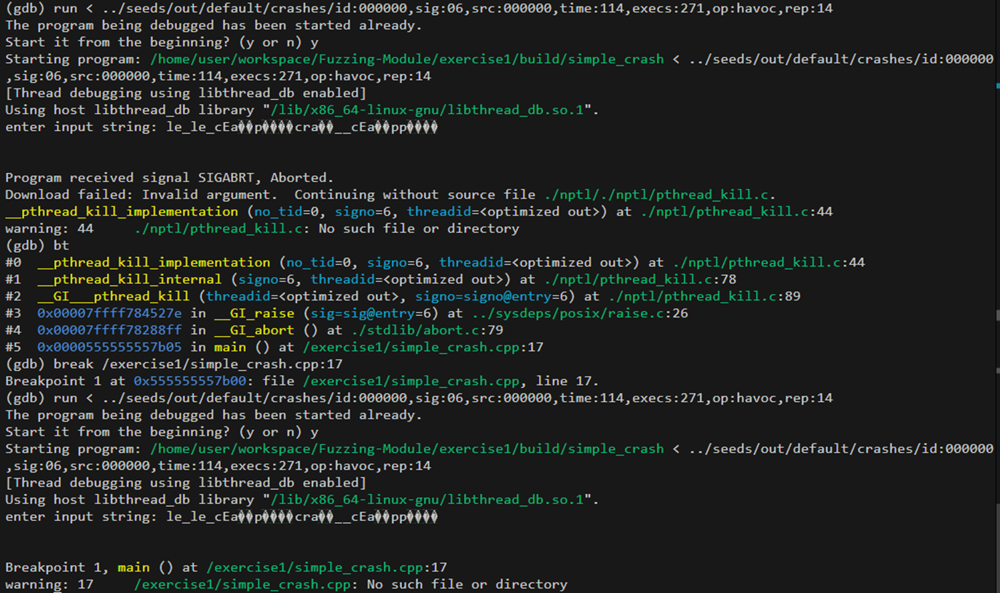

# exercise1: Fuzzing a Simple Program with AFL++

```bash
docker pull aflplusplus/aflplusplus
docker run -it --rm -v $(pwd):/src aflplusplus/aflplusplus bash
```

```bash
read -p "Press enter to build the target program..."

# build src with afl-gcc
rm -rf /src/build
mkdir -p /src/build
cd /src/build
CC=/AFLplusplus/afl-clang-fast CXX=/AFLplusplus/afl-clang-fast++ cmake ..
make

read -p "Press enter to create seed files..."

# create seed files
rm -rf /src/seeds
mkdir -p /src/seeds
for i in {0..4}; do dd if=/dev/urandom of=/src/seeds/seed_$i bs=64 count=10; done
# enter to continue

read -p "Press enter to start fuzzing..."

# start fuzzing with afl-fuzz
/AFLplusplus/afl-fuzz -i /src/seeds -o out -m none -d -- /src/build/simple_crash
```

## asm code analysis

```bash
# analyze the asm code of simple_crash (using INTEL syntax)
cd /src/build

# Disassembling Executable Sections
objdump -d -M intel simple_crash > simple_crash_disasm.asm
# interleave source code with assembly  (if compiled with debug symbols)
objdump -d -M intel -S simple_crash > simple_crash_with_source.asm
# Displaying overall file header information, including architecture, file format, and entry point
objdump -f simple_crash > simple_crash_file_header.txt
# Displaying object-specific file header contents, such as program headers
objdump -p simple_crash > simple_crash_object_header.txt
# Listing the section headers, showing details like section type, size, and memory location
objdump -h simple_crash > simple_crash_section_header.txt
# Displaying comprehensive header information, including all headers, section headers, program headers, and the symbol table
objdump -x simple_crash > simple_crash_all_header.txt
# Displaying the hexadecimal contents of all sections
objdump -s simple_crash > simple_crash_section_hex.txt
```

## analysis with gdb

```bash
# analyze simple_crash with gdb
cd /src/build
gdb ./simple_crash
``` 
